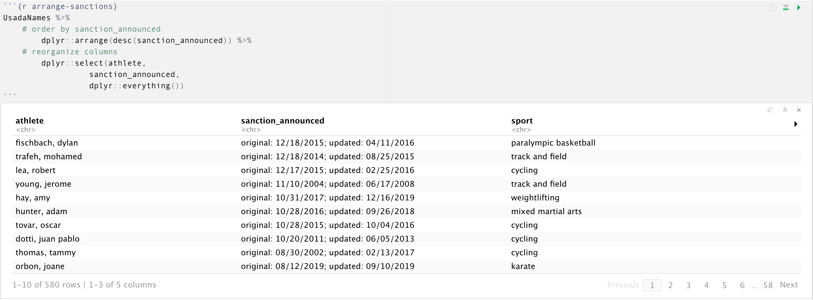

Part 02.0: United States Anti-Doping Agency Sanction Data - Wrangle
Sanction Dates
================
Martin Frigaard
2020-06-08

> See my previous
> [script](https://github.com/mjfrigaard/dope-data/blob/master/code/01.0-scrape-usada.R)
> on scraping the USADA website. That document covers scraping an html
> table in and converting it to a data.frame in R, then exporting the
> data as a .csv file.

``` r
# fs::dir_ls("code")
source("code/01.0-scrape-usada.R")
```

# Motivation (wrangling outline)

I’ve found it’s a good habit to outline my data wrangling strategy
*before* diving in and getting started. The `tidyverse` has almost made
data manipulation processes in R *too* enjoyable, because sometimes I’ll
jump in and start trying to solve a problem, then come back and realize
there was a simpler solution.

So to start I will locate my files, outline a rough data wrangling plan
based on what I currently know about these data, then get to work.

## Where is my stuff?

This post is a continuation of a previous tutorial, so I need to locate
those files. The [`here`](https://github.com/jennybc/here_here) and
[`fs`](https://github.com/r-lib/fs) packages are incredibly helpful for
managing your project files.

``` r
library(here)
library(fs)
```

`here` give me some useful feedback about how it works right from the
start. See the message below:

`here() starts at /Users/me/the/path/to/your/project/doping-data/`.

But why? How does it know? I can figure this out with `here::dr_here()`

``` r
here::dr_here()
```

I can use the `fs::dir_info()` to find the latest data set in the
`data/raw` folder. The data folder structure is below.

``` r
recent_raw_data_file_path <- fs::dir_info("data/raw") %>% 
  dplyr::select(path, birth_time) %>% 
  dplyr::arrange(desc(birth_time)) %>% 
  dplyr::slice(1) %>% 
  dplyr::select(path) %>% 
  as_vector()
recent_raw_data_file_path
```

    #>                   path 
    #>  "data/raw/2020-06-08"

I’ll take the most recent file () using `here::here()` and
`fs::dir_info()`, then I will assign this to
`recent_raw_data_file_path`. If you are curious how `lubridate::today()`
works, see below.

``` r
today <- lubridate::today()
today
```

    #>  [1] "2020-06-08"

I can `paste0()` this `today` vector to the `recent_raw_data_file_path`
object and create a complete file path with `here::here()`.

``` r
raw_data_csv_path <- here::here(recent_raw_data_file_path, 
                                base::paste0("UsadaRaw-", today,".csv"))
raw_data_csv_path
```

    #>  [1] "/Users/mjfrigaard/Dropbox/@incubator/doping-data/data/raw/2020-06-08/UsadaRaw-2020-06-08.csv"

By storing `recent_raw_data_file_path` and `raw_data_csv_path` in
vectors this way, the workflow will always return the most recent data
set.

## Import the .csv file

Now I can import the `UsadaRaw` .csv file with the `raw_data_csv_path`
object.

``` r
UsadaRaw <- readr::read_csv(file = raw_data_csv_path)
```

    #>  Parsed with column specification:
    #>  cols(
    #>    Athlete = col_character(),
    #>    Sport = col_character(),
    #>    `Substance/Reason` = col_character(),
    #>    `Sanction Terms` = col_character(),
    #>    `Sanction Announced` = col_character()
    #>  )

## Style guides

I follow the Style Guide from [Advanced
R](http://adv-r.had.co.nz/Style.html) for naming objects in R. Other
options exist, but I suggest setting up some naming rules to help you
stay organized. I prefer the Advanced R Style Guide because the naming
convention separates objects by class:

  - `DataFrames` (like `UsadaRaw`)
  - `vector_names` (like `raw_data_path`, but this also extends to the
    columns/variables inside data frames)
  - `myFunctions()` (like `csv_Outfile()`)

I’ll take a quick look at the imported data frame with `dplyr`’s
`glimpse()` function.

``` r
UsadaRaw %>% dplyr::glimpse(78)
```

    #>  Rows: 763
    #>  Columns: 5
    #>  $ Athlete              <chr> "Walsh, Cole", "Romero Noboa, Isidro", "Gastel…
    #>  $ Sport                <chr> "Track and Field", "Triathlon", "Mixed Martial…
    #>  $ `Substance/Reason`   <chr> "Cannabinoids", "Androgenic Anabolic Steroid; …
    #>  $ `Sanction Terms`     <chr> "6-Month Suspension with 3-Month Deferral; Los…
    #>  $ `Sanction Announced` <chr> "06/01/2020", "05/22/2020", "05/11/2020", "05/…

## Wrangle the data frame

If possible, I try to think of any changes I can apply across an entire
data frame before changes to individual variables or values. For
example, the column names in the `UsadaRaw` data frame contain some
unruly characters (white spaces, forward slash, etc,), so I know I will
need to clean these up (see `janitor::clean_names()`).

I can also see the text characters in the data frame have a combination
of upper and lowercase characters. This will cause some additional
headache when I start using regular expression patterns, so I’ll convert
these to lowercase (with a combination of `purrr::map_df()` and
`stringr::str_to_lower()`).

### Cleaning the variable names

The `clean_names()` function from the
[`janitor`](https://cran.r-project.org/web/packages/janitor/vignettes/janitor.html)
package lets me quickly format all of the column names in the `UsadaRaw`
data frame. This function has a `case` argument that allows me to select
how I want to format the column names.

``` r
library(janitor)
Usada <- UsadaRaw %>% 
    janitor::clean_names(dat = ., 
                         case = "snake")
Usada %>% glimpse(78)
```

    #>  Rows: 763
    #>  Columns: 5
    #>  $ athlete            <chr> "Walsh, Cole", "Romero Noboa, Isidro", "Gastelum…
    #>  $ sport              <chr> "Track and Field", "Triathlon", "Mixed Martial A…
    #>  $ substance_reason   <chr> "Cannabinoids", "Androgenic Anabolic Steroid; Ca…
    #>  $ sanction_terms     <chr> "6-Month Suspension with 3-Month Deferral; Loss …
    #>  $ sanction_announced <chr> "06/01/2020", "05/22/2020", "05/11/2020", "05/04…

### Use iteration (wherever possible)

The [`purrr`](https://purrr.tidyverse.org/) package is excellent for
iteration and functional programming. Both of these topics are too large
to cover in this post, but I will demonstrate an example with the
`purrr::map_df()` function:

`purrr::map_df()` takes a data frame (`.x`) and in input, and applies a
function (`.f`) across it.

``` r
# lowercase text -----
Usada <- purrr::map_df(.x = Usada, .f = stringr::str_to_lower)
Usada %>% dplyr::glimpse(78)
```

    #>  Rows: 763
    #>  Columns: 5
    #>  $ athlete            <chr> "walsh, cole", "romero noboa, isidro", "gastelum…
    #>  $ sport              <chr> "track and field", "triathlon", "mixed martial a…
    #>  $ substance_reason   <chr> "cannabinoids", "androgenic anabolic steroid; ca…
    #>  $ sanction_terms     <chr> "6-month suspension with 3-month deferral; loss …
    #>  $ sanction_announced <chr> "06/01/2020", "05/22/2020", "05/11/2020", "05/04…

Great. Now I will move onto formatting/wrangling the individual columns.

## Wrangle the variables

There are some useful bits of information on the data we extracted from
the USADA website. Have you ever heard anyone say, “the Devil is in the
details?” Well, the details are in the documentation.

> Below is a listing of athletes that have received a sanction for a
> doping violation under the athlete’s international federation rules
> and/or the USOC Anti-Doping Policies. The Release Date listed in the
> table corresponds to the date the sanction was publicly announced. For
> more information about a specific sanction please reference the
> official press release announcing the anti-doping rule violation.
> Please visit the news section [here](https://www.usada.org/news/) or
> use the site’s search area. You can narrow the list by keyword (sport,
> name, substance, etc.) using the search box below.

> \*Athlete names are removed from this database each January if the
> athlete’s sanction(s) ended 10 years prior. While the name is removed,
> all other sanction data remains in the Sanction List to ensure the
> integrity of the database.

### Removing the missing names

I’ll go head and separate the missing names from the rest of the
sanction data and store it in the `UsadaNoNames` data frame.

``` r
# create no name sanctions
UsadaNoNames <- Usada %>% 
    dplyr::filter(athlete == "*name removed")
# create named sanctions
UsadaNames <- Usada %>% 
    dplyr::filter(athlete != "*name removed")
UsadaNoNames %>% dplyr::glimpse(78)
```

    #>  Rows: 166
    #>  Columns: 5
    #>  $ athlete            <chr> "*name removed", "*name removed", "*name removed…
    #>  $ sport              <chr> "gymnastics", "cycling", "paralympic track and f…
    #>  $ substance_reason   <chr> "triamcinolone acetonide", "cannabinoids", "cann…
    #>  $ sanction_terms     <chr> "public warning - loss of results", "3-month sus…
    #>  $ sanction_announced <chr> NA, NA, NA, NA, NA, NA, NA, NA, NA, NA, NA, NA, …

``` r
UsadaNames %>% dplyr::glimpse(78)
```

    #>  Rows: 595
    #>  Columns: 5
    #>  $ athlete            <chr> "walsh, cole", "romero noboa, isidro", "gastelum…
    #>  $ sport              <chr> "track and field", "triathlon", "mixed martial a…
    #>  $ substance_reason   <chr> "cannabinoids", "androgenic anabolic steroid; ca…
    #>  $ sanction_terms     <chr> "6-month suspension with 3-month deferral; loss …
    #>  $ sanction_announced <chr> "06/01/2020", "05/22/2020", "05/11/2020", "05/04…

I will come back to the `UsadaNoNames` data frame after wrangling the
sanction data with athlete names.

### Format the sanction dates

My `UsadaNames` data frame has a single date column
(`sanction_announced`), but it’s currently formatted as a character
(`<chr>`). To change this into a date format, I’ll get help from
`dplyr::mutate()` and `lubridate::mdy()`. I like to use the `%>%`
operator to test wrangling operations before assigning them to a data
frame.

``` r
# format sanction announced date ------
# test
UsadaNames %>% 
    dplyr::mutate(sanction_date = lubridate::mdy(sanction_announced))
```

    #>  Warning: 22 failed to parse.

    #>  # A tibble: 595 x 6
    #>     athlete sport substance_reason sanction_terms sanction_announ…
    #>     <chr>   <chr> <chr>            <chr>          <chr>           
    #>   1 walsh,… trac… cannabinoids     6-month suspe… 06/01/2020      
    #>   2 romero… tria… androgenic anab… 4-year suspen… 05/22/2020      
    #>   3 gastel… mixe… cannabinoids     9-month suspe… 05/11/2020      
    #>   4 ortiz,… weig… cannabinoids     12-month susp… 05/04/2020      
    #>   5 hurst,… weig… androgenic anab… 4-year suspen… 04/24/2020      
    #>   6 saccen… weig… non-analytical:… 8-year suspen… 04/16/2020      
    #>   7 penche… mixe… non-analytical:… 2-year suspen… 03/23/2020      
    #>   8 gleave… cycl… oxandrolone; cl… 4-year suspen… 03/20/2020      
    #>   9 bond, … cycl… non-analytical:… 4-year suspen… 03/18/2020      
    #>  10 aguero… weig… amphetamine; mo… 4-year suspen… 03/12/2020      
    #>  # … with 585 more rows, and 1 more variable: sanction_date <date>

Yikes\! This shows that `22` dates `failed to parse`. I’ll investigate
these values before assigning them to a new variable.

I can use the `dplyr::arrange()` function to figure out what is going on
with these dates.

``` r
UsadaNames %>%
    # order by sanction_announced
        dplyr::arrange(desc(sanction_announced)) %>% 
    # reorganize columns
        dplyr::select(athlete, 
                  sanction_announced,
                  dplyr::everything())
```

    #>  # A tibble: 595 x 5
    #>     athlete  sanction_announced sport   substance_reason     sanction_terms    
    #>     <chr>    <chr>              <chr>   <chr>                <chr>             
    #>   1 fischba… original: 12/18/2… paraly… non-analytical: ref… "2-year suspensio…
    #>   2 trafeh,… original: 12/18/2… track … non-analytical: use… "4-year suspensio…
    #>   3 lea, ro… original: 12/17/2… cycling noroxycodone         "6-month suspensi…
    #>   4 young, … original: 11/10/2… track … erythropoietin (epo… "lifetime suspens…
    #>   5 hay, amy original: 10/31/2… weight… ostarine             "2-year suspensio…
    #>   6 hunter,… original: 10/28/2… mixed … tamoxifen; boldenon… "2-year suspensio…
    #>   7 tovar, … original: 10/28/2… cycling androgenic anabolic… "2-year suspensio…
    #>   8 dotti, … original: 10/20/2… cycling androgenic anabolic… "2-year suspensio…
    #>   9 thomas,… original: 08/30/2… cycling norbolethone         "lifetime ban - l…
    #>  10 orbon, … original: 08/12/2… karate  lgd-4033             "9-month suspensi…
    #>  # … with 585 more rows

It looks like some of the dates have and `original` and `upated`
sanction date. These will have to be separated and reorganized into a
single column.

### Problem dates (two variables in one column)

The table output in the Rmarkdown file shows me what happened in at
least two of the dates that failed to parse.



I want to separate these troubling dates from the other data, fix them,
then bind them back to the `UsadaNames` data.

``` r
UsadaBadDates <- UsadaNames %>%
    dplyr::filter(stringr::str_detect(string = sanction_announced,
                                      pattern = "original")) %>% 
    dplyr::select(athlete, 
                  sanction_announced,
                  dplyr::everything())
UsadaBadDates
```

    #>  # A tibble: 22 x 5
    #>     athlete   sanction_announced sport   substance_reason    sanction_terms    
    #>     <chr>     <chr>              <chr>   <chr>               <chr>             
    #>   1 werdum, … original 09/11/20… mixed … trenbolone          "2-year suspensio…
    #>   2 jones, s… original: 06/17/2… paraly… stanozolol          "4-year suspensio…
    #>   3 hay, amy  original: 10/31/2… weight… ostarine            "2-year suspensio…
    #>   4 orbon, j… original: 08/12/2… karate  lgd-4033            "9-month suspensi…
    #>   5 ribas, a… original: 01/10/2… mixed … ostarine            "2-year suspensio…
    #>   6 saccente… original: 02/14/2… weight… androgenic anaboli… "4-year suspensio…
    #>   7 miyao, p… original: 05/10/2… brazil… clomiphene          "2-year suspensio…
    #>   8 garcia d… original: 07/10/2… cyclin… non-analytical      "5-year suspensio…
    #>   9 bruyneel… original: 04/22/2… cyclin… non-analytical: ad… "lifetime suspens…
    #>  10 celaya l… original: 04/22/2… cyclin… non-analytical      "lifetime suspens…
    #>  11 marti, j… original: 04/22/2… cyclin… non-analytical      "15-year suspensi…
    #>  12 moffett,… original: 04/24/2… cycling testosterone and c… "21-month suspens…
    #>  13 hunter, … original: 10/28/2… mixed … tamoxifen; boldeno… "2-year suspensio…
    #>  14 bailey, … original: 08/03/2… bobsle… 1,3-dimethylbutyla… "2-year suspensio…
    #>  15 thomas, … original: 08/30/2… cycling norbolethone        "lifetime ban - l…
    #>  16 tovar, o… original: 10/28/2… cycling androgenic anaboli… "2-year suspensio…
    #>  17 fischbac… original: 12/18/2… paraly… non-analytical: re… "2-year suspensio…
    #>  18 lea, rob… original: 12/17/2… cycling noroxycodone        "6-month suspensi…
    #>  19 trafeh, … original: 12/18/2… track … non-analytical: us… "4-year suspensio…
    #>  20 dotti, j… original: 10/20/2… cycling androgenic anaboli… "2-year suspensio…
    #>  21 oliveira… original: 04/13/2… cycling oxilofrine          "18-month suspens…
    #>  22 young, j… original: 11/10/2… track … erythropoietin (ep… "lifetime suspens…

In these 22 cases, the variable actually lists two dates:
`original: 05/10/2017` and `;updated: 11/27/2018`. Now I’ll assume all
the dates in the `UsadaNames` are `original`, and the `updated` date is
the only data I need from the `UsadaBadDates` (*at least for right
now*).

### Plan a solution

I’m now in a situation where I have to distinguish between an `original`
and `updated` sanction announced date. There are multiple ways to attack
this problem. I tend to favor solutions that balance relatively clear
code with minimal steps. I’ll apply [Polya’s problem solving
steps](https://math.berkeley.edu/~gmelvin/polya.pdf) to figuring out
what to do in this situation.

1.  Define the problem: *The data have two dates (`original` and
    `updated`) in a single column (`sanction_announced`)*

2.  Devise a plan:
    
      - *I’ll use the `stringr` package to split the bad dates on the
        `"updated"` pattern,*
    
      - *then I’ll use `tidyr::unnest()` function to turn the vectors
        into multiple rows,*
    
      - *use `dplyr::filter()` to remove the “original” dates,*
    
      - *finally, I’ll use `dplyr::mutate()` again with
        stringr::str\_remove\_all()`to format the new`sanction\_date\`
        column*

3.  Carry out the plan: *I execute all the steps outlined above in the
    code chunk below (with details in the comments)*

<!-- end list -->

``` r
UsadaBadDates %>%
        dplyr::mutate(sanction_dates = 
    # 1) split this on the "updated" pattern
             stringr::str_split(string = sanction_announced, 
                                pattern = "updated")) %>% 
    # convert the output from split into multiple rows
        tidyr::unnest(sanction_dates) %>% 
    # check this to see what is happening 
    dplyr::select(athlete, sanction_announced, sanction_dates)
```

    #>  # A tibble: 44 x 3
    #>     athlete         sanction_announced                   sanction_dates        
    #>     <chr>           <chr>                                <chr>                 
    #>   1 werdum, fabric… original 09/11/2018; updated 01/16/… "original 09/11/2018;…
    #>   2 werdum, fabric… original 09/11/2018; updated 01/16/… " 01/16/2020"         
    #>   3 jones, stirley  original: 06/17/2019; updated: 12/1… "original: 06/17/2019…
    #>   4 jones, stirley  original: 06/17/2019; updated: 12/1… ": 12/16/2019"        
    #>   5 hay, amy        original: 10/31/2017; updated: 12/1… "original: 10/31/2017…
    #>   6 hay, amy        original: 10/31/2017; updated: 12/1… ": 12/16/2019"        
    #>   7 orbon, joane    original: 08/12/2019; updated: 09/1… "original: 08/12/2019…
    #>   8 orbon, joane    original: 08/12/2019; updated: 09/1… ": 09/10/2019"        
    #>   9 ribas, amanda   original: 01/10/2018; updated 05/03… "original: 01/10/2018…
    #>  10 ribas, amanda   original: 01/10/2018; updated 05/03… " 05/03/2019"         
    #>  # … with 34 more rows

We can see all of the `updated` dates are on a new line, and the
`original` dates still contain the text. Now I can filter out the rows
with an `original` date (because I am only interested in the `updated`
dates for now).

``` r
UsadaBadDates %>%
        dplyr::mutate(sanction_dates = 
    # 1) split this on the "updated" pattern
             stringr::str_split(string = sanction_announced, 
                                pattern = "updated")) %>% 
    # 2) convert the output from split into multiple rows
        tidyr::unnest(sanction_dates) %>%  
    # 3) remove the "original" dates 
        dplyr::filter(!str_detect(string = sanction_dates, 
                                  pattern = "original")) %>% 
      # 4) check this to see what is happening 
    dplyr::select(athlete, sanction_announced, sanction_dates)
```

    #>  # A tibble: 22 x 3
    #>     athlete               sanction_announced                     sanction_dates
    #>     <chr>                 <chr>                                  <chr>         
    #>   1 werdum, fabricio      original 09/11/2018; updated 01/16/20… " 01/16/2020" 
    #>   2 jones, stirley        original: 06/17/2019; updated: 12/16/… ": 12/16/2019"
    #>   3 hay, amy              original: 10/31/2017; updated: 12/16/… ": 12/16/2019"
    #>   4 orbon, joane          original: 08/12/2019; updated: 09/10/… ": 09/10/2019"
    #>   5 ribas, amanda         original: 01/10/2018; updated 05/03/2… " 05/03/2019" 
    #>   6 saccente, nicholas    original: 02/14/2017; updated: 12/11/… ": 12/11/2018"
    #>   7 miyao, paulo          original: 05/10/2017;updated: 11/27/2… ": 11/27/2018"
    #>   8 garcia del moral, lu… original: 07/10/2012;updated: 10/26/2… ": 10/26/2018"
    #>   9 bruyneel, johan       original: 04/22/2014;updated: 10/24/2… ": 10/24/2018"
    #>  10 celaya lazama, pedro  original: 04/22/2014;updated: 10/24/2… ": 10/24/2018"
    #>  11 marti, jose           original: 04/22/2014;updated: 10/24/2… ": 10/24/2018"
    #>  12 moffett, shaun        original: 04/24/2018updated: 10/19/20… ": 10/19/2018"
    #>  13 hunter, adam          original: 10/28/2016; updated: 09/26/… ": 09/26/2018"
    #>  14 bailey, ryan          original: 08/03/2017; updated: 12/01/… ": 12/01/2017"
    #>  15 thomas, tammy         original: 08/30/2002; updated: 02/13/… ": 02/13/2017"
    #>  16 tovar, oscar          original: 10/28/2015; updated: 10/04/… ": 10/04/2016"
    #>  17 fischbach, dylan      original: 12/18/2015; updated: 04/11/… ": 04/11/2016"
    #>  18 lea, robert           original: 12/17/2015; updated: 02/25/… ": 02/25/2016"
    #>  19 trafeh, mohamed       original: 12/18/2014; updated: 08/25/… ": 08/25/2015"
    #>  20 dotti, juan pablo     original: 10/20/2011; updated: 06/05/… ": 06/05/2013"
    #>  21 oliveira, flavia      original: 04/13/2010; updated 12/10/2… " 12/10/2010" 
    #>  22 young, jerome         original: 11/10/2004; updated: 06/17/… ": 06/17/2008"

We still need to remove all of the colons and any white-space from the
dates in `sanction_date`.

``` r
(UsadaFixedDates <- UsadaBadDates %>%
        dplyr::mutate(sanction_dates = 
    # 1) split this on the "updated" pattern
             stringr::str_split(string = sanction_announced, 
                                pattern = "updated")) %>% 
    # 2) convert the output from split into multiple rows
        tidyr::unnest(sanction_dates) %>%  
    # 3) remove the "original" dates 
        dplyr::filter(!str_detect(string = sanction_dates, 
                                  pattern = "original")) %>% 
    # 4) remove the colon from sanction_dates
        dplyr::mutate(sanction_dates = stringr::str_remove_all(
                                                      string = sanction_dates,
                                                      pattern = ":"),
                      # 5) remove any whitespace
                      sanction_dates = stringr::str_trim(sanction_dates),
                      # 6) format as date
                      sanction_dates = lubridate::mdy(sanction_dates)) %>% 
    # 7) reorganize the variables 
        dplyr::select(athlete,
                      sport,
                      sanction_terms,
                      substance_reason,
                      dplyr::everything()))
```

    #>  # A tibble: 22 x 6
    #>     athlete sport sanction_terms substance_reason sanction_announ…
    #>     <chr>   <chr> <chr>          <chr>            <chr>           
    #>   1 werdum… mixe… "2-year suspe… trenbolone       original 09/11/…
    #>   2 jones,… para… "4-year suspe… stanozolol       original: 06/17…
    #>   3 hay, a… weig… "2-year suspe… ostarine         original: 10/31…
    #>   4 orbon,… kara… "9-month susp… lgd-4033         original: 08/12…
    #>   5 ribas,… mixe… "2-year suspe… ostarine         original: 01/10…
    #>   6 saccen… weig… "4-year suspe… androgenic anab… original: 02/14…
    #>   7 miyao,… braz… "2-year suspe… clomiphene       original: 05/10…
    #>   8 garcia… cycl… "5-year suspe… non-analytical   original: 07/10…
    #>   9 bruyne… cycl… "lifetime sus… non-analytical:… original: 04/22…
    #>  10 celaya… cycl… "lifetime sus… non-analytical   original: 04/22…
    #>  11 marti,… cycl… "15-year susp… non-analytical   original: 04/22…
    #>  12 moffet… cycl… "21-month sus… testosterone an… original: 04/24…
    #>  13 hunter… mixe… "2-year suspe… tamoxifen; bold… original: 10/28…
    #>  14 bailey… bobs… "2-year suspe… 1,3-dimethylbut… original: 08/03…
    #>  15 thomas… cycl… "lifetime ban… norbolethone     original: 08/30…
    #>  16 tovar,… cycl… "2-year suspe… androgenic anab… original: 10/28…
    #>  17 fischb… para… "2-year suspe… non-analytical:… original: 12/18…
    #>  18 lea, r… cycl… "6-month susp… noroxycodone     original: 12/17…
    #>  19 trafeh… trac… "4-year suspe… non-analytical:… original: 12/18…
    #>  20 dotti,… cycl… "2-year suspe… androgenic anab… original: 10/20…
    #>  21 olivei… cycl… "18-month sus… oxilofrine       original: 04/13…
    #>  22 young,… trac… "lifetime sus… erythropoietin … original: 11/10…
    #>  # … with 1 more variable: sanction_dates <date>

Now I can filter out the rows with the bad dates from `UsadaNames`,
remove the `old_date` column from `UsadaBadDates` and bind these two
data frames together into a new `UsadaNames` data frame. I add a `group`
variable to serve as an `.id` so I can verify the data have been
combined correctly.

``` r
# remove bad dates from original data 
UsadaNamesGoodDates <- UsadaNames %>% 
    dplyr::filter(!stringr::str_detect(string = sanction_announced,
                                      pattern = "original"))
# bind these together 
UsadaSanctions <- UsadaFixedDates %>% 
    dplyr::bind_rows(., UsadaNamesGoodDates, 
                     .id = "group")
UsadaSanctions %>% dplyr::glimpse(78)
```

    #>  Rows: 595
    #>  Columns: 7
    #>  $ group              <chr> "1", "1", "1", "1", "1", "1", "1", "1", "1", "1"…
    #>  $ athlete            <chr> "werdum, fabricio", "jones, stirley", "hay, amy"…
    #>  $ sport              <chr> "mixed martial arts", "paralympic track and fiel…
    #>  $ sanction_terms     <chr> "2-year suspension - sanction reduced", "4-year …
    #>  $ substance_reason   <chr> "trenbolone", "stanozolol", "ostarine", "lgd-403…
    #>  $ sanction_announced <chr> "original 09/11/2018; updated 01/16/2020", "orig…
    #>  $ sanction_dates     <date> 2020-01-16, 2019-12-16, 2019-12-16, 2019-09-10,…

### Check the solution

This is where I can check to see if the 22 dates have been added back to
the data set.

``` r
# check bind
UsadaSanctions %>% dplyr::count(group)
```

    #>  # A tibble: 2 x 2
    #>    group     n
    #>    <chr> <int>
    #>  1 1        22
    #>  2 2       573

The `22` in group `1` reassure me that the `22` dates have been
correctly added back to the data set. And now that I have a wrangled
data frame, I can start exploring the variables in the next section.

## Export these data

Now I can export these data frames to the `data/processed` folder.

``` r
# create data folder ----
if (!file.exists("data/processed")) {
    dir.create("data/processed")
}
# export UsadaSanctions
readr::write_csv(as.data.frame(UsadaSanctions), 
                 path = base::paste0("data/processed/", 
                           base::noquote(lubridate::today()),
                           "-03.0-UsadaSanctions.csv"))
# export UsadaSanctions
readr::write_csv(as.data.frame(UsadaSanctions), 
                 path = base::paste0("data/processed/", 
                           base::noquote(lubridate::today()),
                           "-03.0-UsadaNoNames.csv"))

# export the entire image
base::save.image(file = paste0("data/processed/",
                               base::noquote(lubridate::today()), 
                               "-03.0-usada-sanction-dates.RData"))

fs::dir_tree("data/processed", 
             regexp = base::noquote(lubridate::today()))
```

    #>  data/processed
    #>  ├── 2020-06-08-03.0-UsadaNoNames.csv
    #>  ├── 2020-06-08-03.0-UsadaSanctions.csv
    #>  └── 2020-06-08-03.0-usada-sanction-dates.RData
