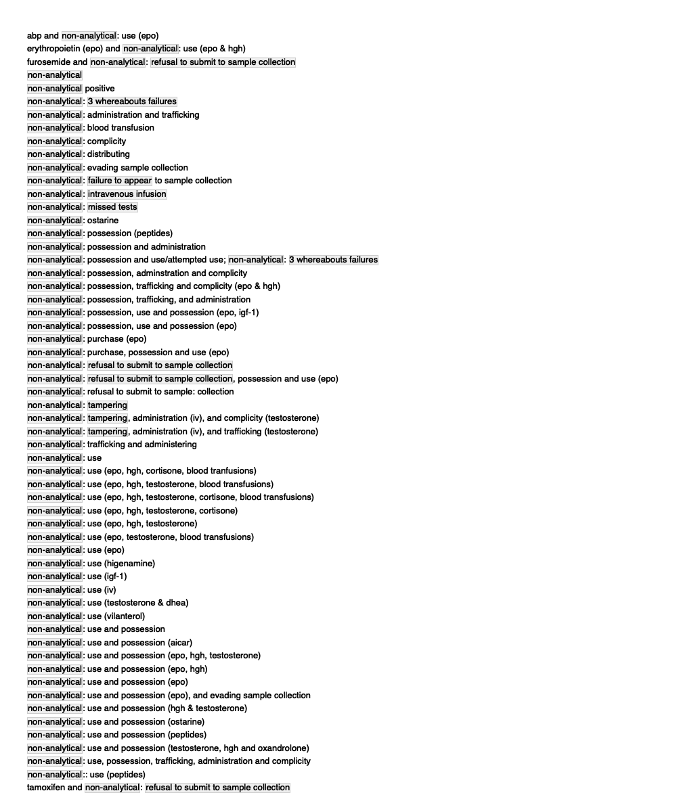
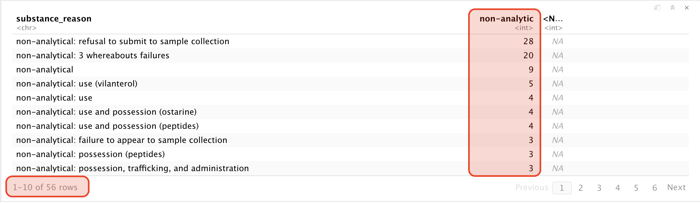
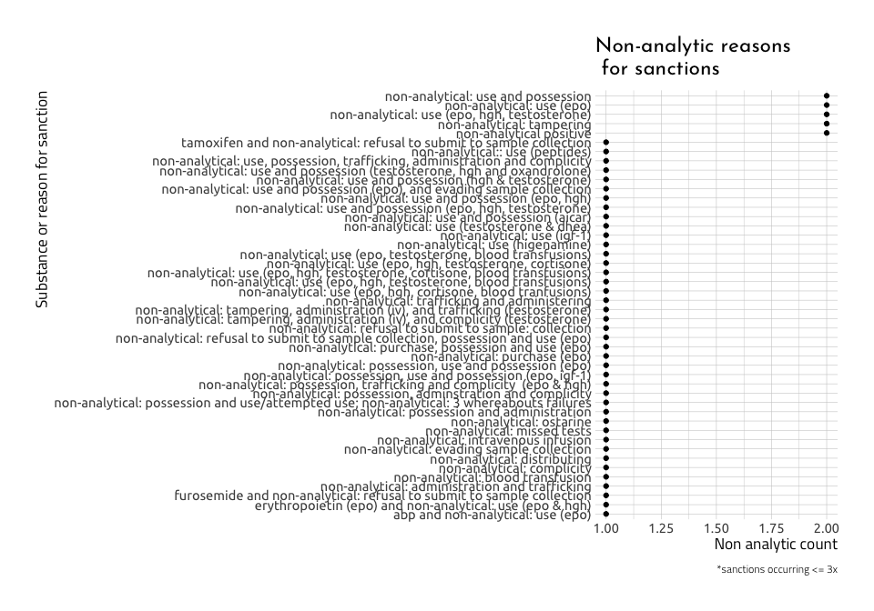

Dope Data Part 03.0 - non-analytic use substances
================
Martin Frigaard
2020-06-08

**Packages**

``` r
library(tidyverse)
library(magrittr)
library(skimr)
library(rlang)
library(gt)
library(visdat)
library(inspectdf)
library(foreign)
library(naniar)
```

# Motivation

This document outlines the wrangling steps for the *non-analytic
sanctions* in the data scraped from the USADA website.

> There are two previous scripts attached to this project that download
> the data from the website and wrangle the dates.

The two code files for producing the `UsadaSanctions`, `UsadaNoNames`,
and `usada-sanction-dates.RData` data image.

``` r
# fs::dir_ls("code")
source("code/01.0-scrape-usada.R")
source("code/02.0-usada-sanction-dates.R")
```

    #> data/processed
    #> ├── 2020-06-08-02.0-UsadaNoNames.csv
    #> ├── 2020-06-08-02.0-UsadaSanctions.csv
    #> ├── 2020-06-08-02.0-usada-sanction-dates.RData
    #> ├── 2020-06-08-03.0-UsadaNoNames.csv
    #> ├── 2020-06-08-03.0-UsadaSanctions.csv
    #> ├── 2020-06-08-03.0-usada-non-analytic.RData
    #> └── 2020-06-08-03.0-usada-sanction-dates.RData

## Import data

In the previous post, I wrangled the data into a new data structure that
looks different from the original data on the [USADA
website](https://www.usada.org/testing/results/sanctions/). These data
are located in the `data/proessed` folder. I can use the `fs::dir_ls()`
functions `regexp` argument to find the most recent files.

``` r
# get the data files in the processed folder
recent_data_files <- fs::dir_info("data/processed") %>% 
  # arrange by 
  dplyr::arrange(desc(path)) %>% 
  # grab the most recent three files
  dplyr::slice(1:3) %>% 
  # get only the path
  dplyr::select(path) %>% 
  # convert to vector
  purrr::as_vector() %>% 
  # un-name
  base::unname(force = TRUE)
recent_data_files
```

    #> [1] "data/processed/2020-06-08-03.0-UsadaSanctions.csv"        
    #> [2] "data/processed/2020-06-08-03.0-UsadaNoNames.csv"          
    #> [3] "data/processed/2020-06-08-03.0-usada-sanction-dates.RData"

Here we can import the latest sanctions data set.

``` r
# the RData
usada_sanction_dates_rdata <- recent_data_files[3]

# the Usada Sanctions
usada_sanctions <- recent_data_files[2]

# the no-names
usada_no_names <- recent_data_files[1]
```

## USADA Sanctions

Below is the `UsadaSanctions` data frame. This data set has the original
dimensions (5 columns, 580 observations).

``` r
UsadaSanctions <- readr::read_csv(usada_sanctions)
UsadaSanctions %>% dplyr::glimpse(78)
```

    #> Rows: 595
    #> Columns: 7
    #> $ group              <dbl> 1, 1, 1, 1, 1, 1, 1, 1, 1, 1, 1, 1, 1, 1, 1, 1, …
    #> $ athlete            <chr> "werdum, fabricio", "jones, stirley", "hay, amy"…
    #> $ sport              <chr> "mixed martial arts", "paralympic track and fiel…
    #> $ sanction_terms     <chr> "2-year suspension - sanction reduced", "4-year …
    #> $ substance_reason   <chr> "trenbolone", "stanozolol", "ostarine", "lgd-403…
    #> $ sanction_announced <chr> "original 09/11/2018; updated 01/16/2020", "orig…
    #> $ sanction_dates     <date> 2020-01-16, 2019-12-16, 2019-12-16, 2019-09-10,…

### The World Anti-Doping Agency’s (WADA) Prohibited List

USADA follows the list of prohibited substances published by the The
World Anti-Doping Agency (WADA). The first list of prohibited substances
was printed by the International Olympic Committee (IOC) in 1967. In the
1972 Munich Games, athletic testing was introduced. The current list of
banned substances can be found on [WADA’s
website](https://www.usada.org/substances/prohibited-list/). A substance
ends up banned when it meets two out of three of the following criteria:

1.  It has the potential to enhance sport performance  
2.  It represents an actual or potential health risk to the athlete  
3.  It violates the spirit of sport

These are all stored in the `substance_reason` variable, but I want them
in the `substances` vector.

``` r
substances <- sort(unique(UsadaSanctions$substance_reason))
substances %>% head()
```

    #> [1] "1-androstenedione and its metabolite"
    #> [2] "1-testosterone and 1-androstenedione"
    #> [3] "1,3-dimethylbutylamine"              
    #> [4] "1,3-dimethylbutylamine (dmba)"       
    #> [5] "1,4‐dimethylpentylamine"             
    #> [6] "1,4‐dimethylpentylamine (1,4‐dmpa)"

``` r
substances %>% tail()
```

    #> [1] "trenbolone"                "trenbolone, epitrenbolone"
    #> [3] "trenbolone; clomiphene"    "tuaminoheptane"           
    #> [5] "vilanterol"                "zeranol"

## \* S0 (Non-approved substances)

This a blanket, catch-all for substances I would consider “obviously
prohibited”.

“*any pharmacological substance which is not addressed by any of the
subsequent sections of the list and with no current approval by any
governmental regulatory health authority for human therapeutic use
(e.g. drugs under pre-clinical or clinical development or discontinued,
designer drugs, substances approved only for veterinary use) is
prohibited at all times.*”

### Non-substance sanctions

We will store these non-substance sanctions in the `non_drug_sanctions`.

``` r
non_drug_sanctions <- c(
  "test evasion",
  "intravenous infusion",
  "test refusal",
  "trafficking and administering prohibitied substances",
  "trafficking and administering prohibited substances",
  "violating period of ineligibility",
  "3 missed tests",
  "3 whereabouts failures",
  "failed to appear",
  "failure to appear",
  "failure to appear for test",
  "failure to appear for testing",
  "manipulation of forms",
  "missed test violation",
  "missed tests",
  "non-analytical",
  "non-analytical positive",
  "non-analytical, ghrfs",
  "non-analytical, possession of prohibited peptides",
  "non-analytical; possession, trafficking, and administration of prohibited substances",
  "possession, trafficking, and administration of prohibited substances",
  "possession, trafficking, and administration of prohibited substances and methods",
  "reduced sanction",
  "sanction restarted for violation",
  "refusal to submit to doping control",
  "refusal to submit to sample collection",
  "refusal to test",
  "refusal/non-analytical positive",
  "tampering"
)
```

Our goal is to use this vector to identify the ‘non-analytic’ substances
in the `substance_reason` variable in the `UsadaSanctions` data set. But
before we attempt this, we can check to see how many words this will
match with `stringr::str_view_all()`.

``` r
# create regex
non_drug_sanctions_regex <- paste0("(", stringr::str_c(non_drug_sanctions, 
                                                   collapse = "|"), ")")
```

The output above shows how the `regex` we created in
`non_drug_sanctions_regex` by pasting the terms together, separated only
by the pipe (`|`).

``` r
writeLines(non_drug_sanctions_regex)
```

    #> (test evasion|intravenous infusion|test refusal|trafficking and administering prohibitied substances|trafficking and administering prohibited substances|violating period of ineligibility|3 missed tests|3 whereabouts failures|failed to appear|failure to appear|failure to appear for test|failure to appear for testing|manipulation of forms|missed test violation|missed tests|non-analytical|non-analytical positive|non-analytical, ghrfs|non-analytical, possession of prohibited peptides|non-analytical; possession, trafficking, and administration of prohibited substances|possession, trafficking, and administration of prohibited substances|possession, trafficking, and administration of prohibited substances and methods|reduced sanction|sanction restarted for violation|refusal to submit to doping control|refusal to submit to sample collection|refusal to test|refusal/non-analytical positive|tampering)

``` r
stringr::str_view_all(string = substances, 
                      pattern = non_drug_sanctions_regex, 
                      match = TRUE)
```

<!-- -->

Assign `non_drug_sanctions_regex` to `UsadaNonAnalytic`.

``` r
UsadaNonAnalytic <- UsadaSanctions %>%
  dplyr::mutate(
      # categories from WADA list
    wada_cat =
      dplyr::case_when(
        # all that match the regex are labeled non-analytic
        stringr::str_detect(string = substance_reason, 
                       pattern = non_drug_sanctions_regex) ~ "non-analytic",
        # all else are NA
        TRUE ~ NA_character_))
```

We can check this new variable by using some counting and filtering.

``` r
UsadaNonAnalytic %>% 
  # tally these up
  dplyr::count(wada_cat, substance_reason) %>% 
  # spread the new variable across the columns 
  tidyr::spread(wada_cat, n) %>% 
  # now filter the substance/reasons to those in the regex
  dplyr::filter(stringr::str_detect(string = substance_reason, 
                       pattern = non_drug_sanctions_regex)) %>%
  # and arrange them by the most common non-analytic sanctions
  dplyr::arrange(desc(`non-analytic`)) 
```

    #> # A tibble: 58 x 3
    #>    substance_reason                                      `non-analytic` `<NA>`
    #>    <chr>                                                          <int>  <int>
    #>  1 non-analytical: refusal to submit to sample collecti…             29     NA
    #>  2 non-analytical: 3 whereabouts failures                            20     NA
    #>  3 non-analytical                                                     9     NA
    #>  4 non-analytical: use (vilanterol)                                   5     NA
    #>  5 non-analytical: use                                                4     NA
    #>  6 non-analytical: use and possession (ostarine)                      4     NA
    #>  7 non-analytical: use and possession (peptides)                      4     NA
    #>  8 non-analytical: failure to appear to sample collecti…              3     NA
    #>  9 non-analytical: possession (peptides)                              3     NA
    #> 10 non-analytical: possession, trafficking, and adminis…              3     NA
    #> # … with 48 more rows

This puts the top non-analytic sanctions in the top of the tibble I can
see printed to the screen. But I only get a peak at the top 10, and
there are 56 rows in this tallied tibble (see image below).



Data like these are easier to make sense of in a visualization, so I
will create two graphs the display the counts of each non-analytic
occurrence. The graph below shows which non-analytic sanctions rank the
highest, and based on the output from the tibble above, I’ve chosen only
to include those that occur 3 or more times.

``` r
UsadaNonAnalytic %>%
    dplyr::count(substance_reason, sort = TRUE) %>% 
    dplyr::filter(n >= 5) %>% 
    dplyr::mutate(substance_reason = reorder(substance_reason, n),
                  non_analytic_count = n) %>% 
    # remove the non-missing
    dplyr::filter(stringr::str_detect(
        string = substance_reason, 
        pattern = non_drug_sanctions_regex)) %>% 
    ggplot2::ggplot(aes(x = substance_reason, 
                        y = non_analytic_count)) + 
    geom_line(aes(group = substance_reason)) +
    ggplot2::geom_point() + 
    ggplot2::labs(x = "Substance or reason for sanction", 
          y = "Non analytic count",
          title = "Non-analytic reasons for sanctions",
          subtitle = "*sanctions occurring more than three times") + 
    ggplot2::coord_flip()
```

<!-- -->

It’s pretty clear the most common reason for getting a non-analytic
sanction was a ‘refusal to appear’. I will look at the remaining
non-analytic sanctions below by adjusting the graph to include only
those that occur less than three times.

``` r
UsadaNonAnalytic %>%
    dplyr::count(substance_reason, sort = TRUE) %>% 
    dplyr::filter(n < 3) %>% 
    dplyr::mutate(substance_reason = reorder(substance_reason, n),
                  non_analytic_count = n) %>% 
    # remove the non-missing
    dplyr::filter(stringr::str_detect(
        string = substance_reason, 
        pattern = non_drug_sanctions_regex)) %>% 
    ggplot2::ggplot(aes(x = substance_reason, 
                        y = non_analytic_count)) + 
    ggplot2::geom_point() + 
    ggplot2::labs(x = "Substance or reason for sanction", 
          y = "Non analytic count",
          title = "Non-analytic reasons\n for sanctions",
          caption = "*sanctions occurring <= 3x") + 
    ggplot2::coord_flip()
```

<!-- -->

This graph is less informative, but shows us that many of the
non-analytic sanctions are very specific. This makes it hard to graph
because the we don’t know how the data are grouped.

For example, the `non-analytical: tampering, administration (iv), and
trafficking (testosterone)` category is very similar to `non-analytical:
tampering, administration (iv), and complicity (testosterone)`, but with
an important distinction.

## Alberto Salazar

We will examine the case of Alberto Salazar. Check out the sources
below:

<https://www.nytimes.com/2020/01/31/sports/olympics/alberto-salazar-ban.html>

<https://uscenterforsafesport.org/response-and-resolution/disciplinary-database/>

<https://www.runnersworld.com/news/a29312870/alberto-salazar-doping-ban/>

<https://www.bbc.com/sport/athletics/49882757>

<https://www.bbc.com/sport/athletics/39156296>

In October of 2019, Nike’s head coach was banned for four years after a
two-year USADA investigation found him guilty of `trafficking` a banned
substance (`testosterone`). This comes after a long list of allegations
starting in 2017.

``` r
UsadaNonAnalytic %>% 
  dplyr::filter(substance_reason %in% "non-analytical: tampering, administration (iv), and trafficking (testosterone)")
```

    #> # A tibble: 1 x 8
    #>   group athlete sport sanction_terms substance_reason sanction_announ…
    #>   <dbl> <chr>   <chr> <chr>          <chr>            <chr>           
    #> 1     2 salaza… trac… 4-year suspen… non-analytical:… 09/30/2019      
    #> # … with 2 more variables: sanction_dates <date>, wada_cat <chr>

However, in this same database, we can also find the suspension for
Nike’s paid endocrinologist (Dr. Jeffrey Brown), who was also involved
in the doping probe. The data set does not have any way of indicating
these two data points are *not* athletes.

``` r
UsadaNonAnalytic %>% 
  dplyr::filter(substance_reason %in% "non-analytical: tampering, administration (iv), and complicity (testosterone)")
```

    #> # A tibble: 1 x 8
    #>   group athlete sport sanction_terms substance_reason sanction_announ…
    #>   <dbl> <chr>   <chr> <chr>          <chr>            <chr>           
    #> 1     2 brown,… trac… 4-year suspen… non-analytical:… 09/30/2019      
    #> # … with 2 more variables: sanction_dates <date>, wada_cat <chr>

## Export

We’ll export this image and move onto anabolic steroids.

``` r
base::save.image(file = paste0("data/processed/",
                               base::noquote(lubridate::today()), 
                               "-03.0-usada-non-analytic.RData"))
fs::dir_tree(path = "data/processed", 
           regexp = base::noquote(lubridate::today()))
```

    #> data/processed
    #> ├── 2020-06-08-02.0-UsadaNoNames.csv
    #> ├── 2020-06-08-02.0-UsadaSanctions.csv
    #> ├── 2020-06-08-02.0-usada-sanction-dates.RData
    #> ├── 2020-06-08-03.0-UsadaNoNames.csv
    #> ├── 2020-06-08-03.0-UsadaSanctions.csv
    #> ├── 2020-06-08-03.0-usada-non-analytic.RData
    #> └── 2020-06-08-03.0-usada-sanction-dates.RData
