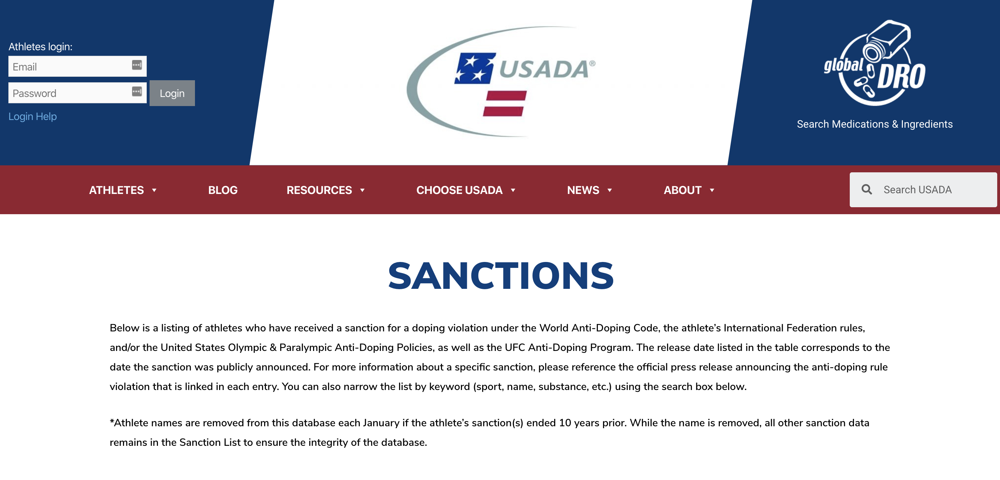
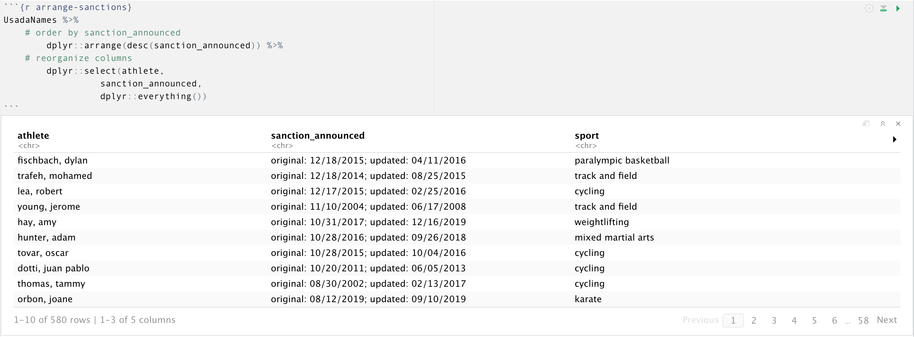
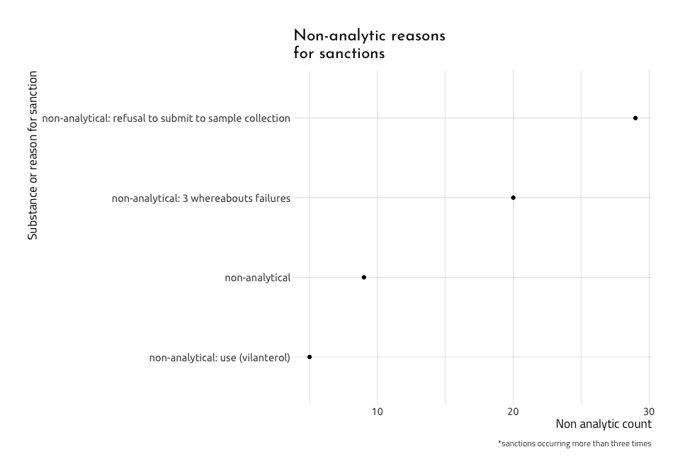

Doping Stats - U.S. Anti-Doping Agency (USADA) data
================
2020-06-08

# Project overview

This project contains data from the US anti-doping agency (USADA) on
athletes, sports, substances, and sanctions.

## The Data Sources

These data comes from the Sanctions table on the USADA
[website.](https://www.usada.org/testing/results/sanctions/)



In order to extract data from the website, visualize the data, and then
put the data into a Shiny application, I will have to start by scraping
the data from the website above. I use the [`rvest`
package](https://cran.r-project.org/web/packages/rvest/index.html)
written by Hadley Wickham to scrape the `html` code.

## Packages

The code chunk below loads the packages needed to reproduce the
graphics.

``` r
library(tidyverse)
library(xml2)
library(rvest)
library(methods)
library(magrittr)
library(ggthemes)
library(extrafont)
library(ggplot2)
library(gridExtra)
library(wesanderson)
library(tidytext)
```

### Part 1: Scraping the USADA website

The website for these data is available
[here](https://tinyurl.com/yc346fq5). The `rvest::read_html()` and
`rvest::html_nodes()` functions extract the content from the table in
the Web page and translates it from HTML into a data frame.

``` r
USADA_url <- "https://www.usada.org/testing/results/sanctions/"
USADA_extraction <- USADA_url %>%
     xml2::read_html() %>%
     rvest::html_nodes("table")
```

> ***Store and explore*** refers to storing an output of a call to an
> object, then checking the contents of that new object. This is a great
> way to get to know R, object-oriented programming, and how functions
> work together in packages.

### Check the structure of the extraction

Look at the structure of `USADA_extraction`.

``` r
# check the structure of the new USADA_extraction object
USADA_extraction %>% str()
```

    #> List of 1
    #>  $ :List of 2
    #>   ..$ node:<externalptr> 
    #>   ..$ doc :<externalptr> 
    #>   ..- attr(*, "class")= chr "xml_node"
    #>  - attr(*, "class")= chr "xml_nodeset"

This contains a `node` and a `doc` in the List of 2.

### Check the class of the extraction

If I check the class of the list we extracted, we find…

``` r
USADA_extraction %>% class()
```

    #> [1] "xml_nodeset"

…this is an `xml_nodeset` with 2 lists (stored within the 1 list). The
data we want from this object is in position `[[1]]` of this list. I can
subset the `USADA_extraction` list with the `rvest::html_table()`
function and store the table contents in the `UsadaRaw` object. I check
my work using the `dplyr::glimpse(70)`.

> why `dplyr::glimpse(70)`? It prints less to the screen and keeps the
> col width to \<80, which is nice for working in plain text.

``` r
UsadaRaw <- rvest::html_table(USADA_extraction[[1]])
UsadaRaw %>% dplyr::glimpse(70)
```

    #> Rows: 763
    #> Columns: 5
    #> $ Athlete              <chr> "Walsh, Cole", "Romero Noboa, Isidro",…
    #> $ Sport                <chr> "Track and Field", "Triathlon", "Mixed…
    #> $ `Substance/Reason`   <chr> "Cannabinoids", "Androgenic Anabolic S…
    #> $ `Sanction Terms`     <chr> "6-Month Suspension with 3-Month Defer…
    #> $ `Sanction Announced` <chr> "06/01/2020", "05/22/2020", "05/11/202…

This reveals a data frame with 763 observations. The contents from the
HTML list (`USADA_extraction`) has been converted to a data frame
(`UsadaRaw`). I’m going to store this data frame as a .csv in a
`data/raw` folder (so I don’t have to scrape it every time I run this
script).

``` r
# create data path
raw_data_path <- "data/raw/"
# create a new data folder
if (!file.exists(raw_data_path)) {
     dir.create(raw_data_path)
}
fs::dir_tree("data", recurse = FALSE)
```

    #> data
    #> ├── processed
    #> └── raw

Great\! I can export these data into the new folder I just created. Now
that I have a time-stamped data set, I will export it as a .csv file.

``` r
# export the .csv file
readr::write_csv(as.data.frame(UsadaRaw), 
          paste0(raw_data_path,
                           "UsadaRaw-",
                           base::noquote(lubridate::today()),
                           ".csv"))
# export as a .RData file, too.
base::save.image(file = paste0(raw_data_path,
                         "UsadaRaw-", 
                         base::noquote(lubridate::today()),
                         ".RData"))
# check
base::writeLines(fs::dir_ls("data/raw", 
                      regexp = base::noquote(lubridate::today())))
```

    #> data/raw/2020-06-08
    #> data/raw/UsadaRaw-2020-06-08.RData
    #> data/raw/UsadaRaw-2020-06-08.csv

## Wrangling: `plan() %>% do()`

### Part 2: Wrangle the sanction dates

Use the combination of `stringr::str_split()` and `tidyr::unnest()` to
wrangle some of the messy dates.

``` r
# check
processed_data <- fs::dir_ls("data/processed", 
      regexp = base::noquote(lubridate::today()))
# choose the csv
usada_sanct_csv_data <- processed_data[2]
# import
UsadaSanct <- readr::read_csv(file = usada_sanct_csv_data)
```



I’ll apply [Polya’s problem solving
steps](https://math.berkeley.edu/~gmelvin/polya.pdf) to figuring out
what to do in this situation.

1.  Define the problem: *The data have two dates (`original` and
    `updated`) in a single column (`sanction_announced`)*

2.  Devise a plan:
    
      - *I’ll use the `stringr` package to split the bad dates on the
        `"updated"` pattern,*
    
      - *then I’ll use `tidyr::unnest()` function to turn the vectors
        into multiple rows,*
    
      - *use `dplyr::filter()` to remove the “original” dates,*
    
      - *finally, I’ll use `dplyr::mutate()` again with
        stringr::str\_remove\_all()`to format the new`sanction\_date\`
        column*

3.  Carry out the plan: *I execute all the steps outlined above in the
    code chunk below (with details in the comments)*

## Visualize the non-analytic sanctions

``` r
# get the data files in the processed folder
recent_data_files <- fs::dir_info("data/processed") %>% 
  # arrange by 
  dplyr::arrange(desc(path)) %>% 
  # grab the most recent three files
  dplyr::slice(1:3) %>% 
  # get only the path
  dplyr::select(path) %>% 
  # convert to vector
  purrr::as_vector() %>% 
  # un-name
  base::unname(force = TRUE)
# the RData
usada_sanction_dates_rdata <- recent_data_files[3]

# the Usada Sanctions
usada_sanctions <- recent_data_files[2]

# the no-names
usada_no_names <- recent_data_files[1]
UsadaSanctions <- readr::read_csv(usada_sanctions)
UsadaSanctions %>% dplyr::glimpse(78)
```

    #> Rows: 595
    #> Columns: 7
    #> $ group              <dbl> 1, 1, 1, 1, 1, 1, 1, 1, 1, 1, 1, 1, 1, 1, 1, 1, …
    #> $ athlete            <chr> "werdum, fabricio", "jones, stirley", "hay, amy"…
    #> $ sport              <chr> "mixed martial arts", "paralympic track and fiel…
    #> $ sanction_terms     <chr> "2-year suspension - sanction reduced", "4-year …
    #> $ substance_reason   <chr> "trenbolone", "stanozolol", "ostarine", "lgd-403…
    #> $ sanction_announced <chr> "original 09/11/2018; updated 01/16/2020", "orig…
    #> $ sanction_dates     <date> 2020-01-16, 2019-12-16, 2019-12-16, 2019-09-10,…

### Non-substance sanctions

We will store these non-substance sanctions in the `non_drug_sanctions`.

``` r
non_drug_sanctions <- c(
  "test evasion",
  "intravenous infusion",
  "test refusal",
  "trafficking and administering prohibitied substances",
  "trafficking and administering prohibited substances",
  "violating period of ineligibility",
  "3 missed tests",
  "3 whereabouts failures",
  "failed to appear",
  "failure to appear",
  "failure to appear for test",
  "failure to appear for testing",
  "manipulation of forms",
  "missed test violation",
  "missed tests",
  "non-analytical",
  "non-analytical positive",
  "non-analytical, ghrfs",
  "non-analytical, possession of prohibited peptides",
  "non-analytical; possession, trafficking, and administration of prohibited substances",
  "possession, trafficking, and administration of prohibited substances",
  "possession, trafficking, and administration of prohibited substances and methods",
  "reduced sanction",
  "sanction restarted for violation",
  "refusal to submit to doping control",
  "refusal to submit to sample collection",
  "refusal to test",
  "refusal/non-analytical positive",
  "tampering"
)
# also store the substances
substances <- sort(unique(UsadaSanctions$substance_reason))
```

Our goal is to use this vector to identify the ‘non-analytic’ substances
in the `substance_reason` variable in the `UsadaSanctions` data set. But
before we attempt this, we can check to see how many words this will
match with `stringr::str_view_all()`.

``` r
# create regex
non_drug_sanctions_regex <- paste0("(", stringr::str_c(non_drug_sanctions, 
                                                   collapse = "|"), ")")
```

The output above shows how the `regex` we created in
`non_drug_sanctions_regex` by pasting the terms together, separated only
by the pipe (`|`).

``` r
writeLines(non_drug_sanctions_regex)
```

    #> (test evasion|intravenous infusion|test refusal|trafficking and administering prohibitied substances|trafficking and administering prohibited substances|violating period of ineligibility|3 missed tests|3 whereabouts failures|failed to appear|failure to appear|failure to appear for test|failure to appear for testing|manipulation of forms|missed test violation|missed tests|non-analytical|non-analytical positive|non-analytical, ghrfs|non-analytical, possession of prohibited peptides|non-analytical; possession, trafficking, and administration of prohibited substances|possession, trafficking, and administration of prohibited substances|possession, trafficking, and administration of prohibited substances and methods|reduced sanction|sanction restarted for violation|refusal to submit to doping control|refusal to submit to sample collection|refusal to test|refusal/non-analytical positive|tampering)

``` r
stringr::str_view_all(string = substances, 
                      pattern = non_drug_sanctions_regex, 
                      match = TRUE)
```

<!-- -->

Assign `non_drug_sanctions_regex` to `UsadaNonAnalytic`.

``` r
UsadaNonAnalytic <- UsadaSanctions %>%
  dplyr::mutate(
      # categories from WADA list
    wada_cat =
      dplyr::case_when(
        # all that match the regex are labeled non-analytic
        stringr::str_detect(string = substance_reason, 
                       pattern = non_drug_sanctions_regex) ~ "non-analytic",
        # all else are NA
        TRUE ~ NA_character_))
```

We can check this new variable by using some counting and filtering.

``` r
UsadaNonAnalytic %>% 
  # tally these up
  dplyr::count(wada_cat, substance_reason) %>% 
  # spread the new variable across the columns 
  tidyr::pivot_wider(names_from = wada_cat, values_from = n) %>% 
  # now filter the substance/reasons to those in the regex
  dplyr::filter(stringr::str_detect(string = substance_reason, 
                       pattern = non_drug_sanctions_regex)) %>%
  # and arrange them by the most common non-analytic sanctions
  dplyr::arrange(desc(`non-analytic`)) 
```

    #> # A tibble: 58 x 3
    #>    substance_reason                                       `non-analytic`  `NA`
    #>    <chr>                                                           <int> <int>
    #>  1 non-analytical: refusal to submit to sample collection             29    NA
    #>  2 non-analytical: 3 whereabouts failures                             20    NA
    #>  3 non-analytical                                                      9    NA
    #>  4 non-analytical: use (vilanterol)                                    5    NA
    #>  5 non-analytical: use                                                 4    NA
    #>  6 non-analytical: use and possession (ostarine)                       4    NA
    #>  7 non-analytical: use and possession (peptides)                       4    NA
    #>  8 non-analytical: failure to appear to sample collection              3    NA
    #>  9 non-analytical: possession (peptides)                               3    NA
    #> 10 non-analytical: possession, trafficking, and administ…              3    NA
    #> # … with 48 more rows

``` r
UsadaSanctions %>%
    dplyr::count(substance_reason, sort = TRUE) %>% 
    dplyr::filter(n >= 5) %>% 
    dplyr::mutate(substance_reason = reorder(substance_reason, n),
                  non_analytic_count = n) %>% 
    # remove the non-missing
    dplyr::filter(stringr::str_detect(
        string = substance_reason, 
        pattern = non_drug_sanctions_regex)) %>% 
    ggplot2::ggplot(aes(x = substance_reason, 
                        y = non_analytic_count)) + 
    geom_line(aes(group = substance_reason)) +
    ggplot2::geom_point() + 
    ggplot2::labs(x = "Substance or reason for sanction", 
          y = "Non analytic count",
          title = "Non-analytic reasons\nfor sanctions",
          caption = "*sanctions occurring more than three times") + 
    ggplot2::coord_flip()
```

<!-- -->

All other non-analytic sanctions

``` r
UsadaNonAnalytic %>%
    dplyr::count(substance_reason, sort = TRUE) %>% 
    dplyr::filter(n < 3) %>% 
    dplyr::mutate(substance_reason = reorder(substance_reason, n),
                  non_analytic_count = n) %>% 
    # remove the non-missing
    dplyr::filter(stringr::str_detect(
        string = substance_reason, 
        pattern = non_drug_sanctions_regex)) %>% 
    ggplot2::ggplot(aes(x = substance_reason, 
                        y = non_analytic_count)) + 
    ggplot2::geom_point() + 
    ggplot2::labs(x = "Substance or reason for sanction", 
          y = "Non analytic count",
          title = "Non-analytic reasons\n for sanctions",
          caption = "*sanctions occurring <= 3x") + 
    ggplot2::coord_flip()
```

<!-- -->
